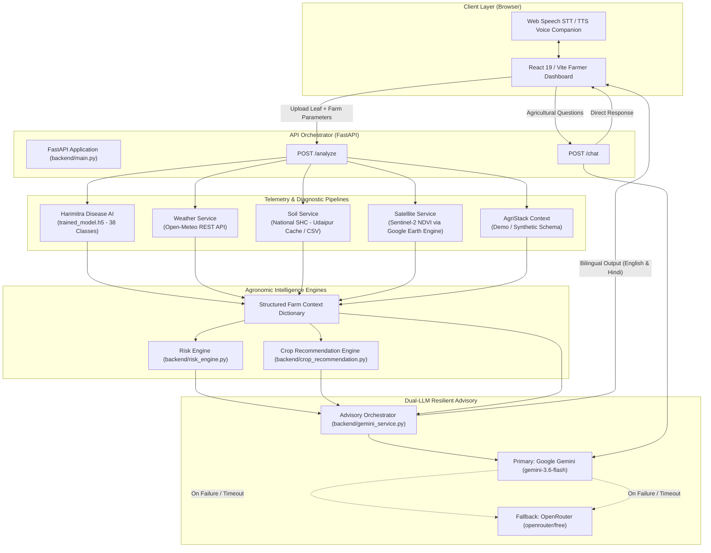

# KrashiMitra — AI-Powered Agricultural Intelligence Platform

> A multi-modal agronomic intelligence and diagnostic system for Indian farmers, fusing crop pathology computer vision, in-situ Soil Health Card telemetry, real-time meteorological forecasting, and Sentinel-2 satellite observation into grounded, actionable, bilingual advisory.

---

## 1. Project Title & Overview

**KrashiMitra** is an AI-powered agricultural intelligence platform developed as a hackathon prototype for presentation and submission at the **Build with AI: Code for Communities — 2nd Edition** hackathon, associated with Google Cloud and hosted on the Hack2Skill platform. Designed to provide smallholder farmers with holistic, data-grounded farm advisories, KrashiMitra unifies four critical layers of agricultural telemetry:
1. **Leaf Pathology Computer Vision:** Deep learning diagnosis across 38 crop condition classes using the Harimitra AI model.
2. **In-Situ Soil Records:** 12-parameter soil fertility benchmarking based on the Government of India National Soil Health Card (SHC) scheme.
3. **Hyperlocal Meteorological Forecasts:** Real-time temperature, relative humidity, and precipitation probability via Open-Meteo.
4. **Earth Observation Remote Sensing:** Multispectral vegetation health indexing (Sentinel-2 NDVI) via Google Earth Engine.

These signals feed into a deterministic risk and crop suitability engine, producing grounded, bilingual (Devanagari Hindi and English) advisories powered by Google Gemini with automatic OpenRouter fallback, accessible through a responsive web dashboard with voice input and output.

---

## 2. Problem Statement

Indian agriculture supports hundreds of millions of livelihoods, yet smallholder farmers face compounding diagnostic and advisory challenges:
* **Fragmented & Isolated Diagnostics:** Farmers typically rely on visual inspection or single-purpose photo apps that overlook essential soil chemistry, moisture, and microclimate context.
* **Over-Fertilization & Nutrient Imbalances:** Fertilizer is frequently applied without reference to Soil Health Card data, degrading soil biology and inflating input costs.
* **Climate & Weather Volatility:** Unanticipated precipitation events immediately after pesticide or fertilizer applications lead to chemical runoff and wasted expenditure.
* **Language & Digital Literacy Barriers:** Complex technical advisories are rarely available in simple, vernacular language with voice assistance.
* **LLM Hallucination in Agriculture:** Generative AI without strict grounding can invent unverified pesticide dosages or chemical treatments, posing severe safety and crop hazards.

---

## 3. Our Solution

KrashiMitra addresses these challenges by orchestrating a **multi-modal farm context** pipeline:
* **Holistic Diagnostic Decisioning:** Combines vision-based pathology detection with in-situ soil measurements, ambient weather, and satellite vegetation trends.
* **Deterministic Agronomic Rules:** Crop recommendations and risk levels are computed using rule-based algorithms with transparent rationales and explicit data-completeness scoring, rather than unconstrained generative guesses.
* **Strictly Grounded Bilingual LLM Advisory:** A multi-tier LLM pipeline (Gemini 3.6 Flash primary, OpenRouter free tier fallback) operates under strict system constraints: it generates twin advisories in English and natural Devanagari Hindi, refuses to invent unverified chemical treatments, and flags missing data parameters.
* **Inclusive Voice-First UI:** Built-in Speech-to-Text (STT) and Text-to-Speech (TTS) allow farmers to speak queries and listen to advice in their chosen language.

---

## 4. Key Features

| Feature | Category | Implementation Status | Description |
| :--- | :--- | :--- | :--- |
| **Harimitra Disease AI** | Computer Vision | **Implemented** | 38-class leaf condition classification using a Keras deep learning model (`trained_model.h5`). |
| **12-Parameter Soil Card** | Soil Intelligence | **Implemented (Udaipur Demo)** | Evaluates Primary NPK, Micronutrients (S, Zn, Fe, Cu, Mn, B), and Physical-Chemical indices (pH, EC, Organic Carbon). |
| **Hyperlocal Weather** | Meteorology | **Implemented** | Fetches live ambient temperature, relative humidity, and 7-day precipitation probabilities from Open-Meteo. |
| **Sentinel-2 Satellite NDVI** | Remote Sensing | **Implemented (Subject to GEE auth)** | Calculates mean, median, min, and max Normalized Difference Vegetation Index (NDVI) within a 500m buffer via Google Earth Engine. |
| **Automated Irrigation Advice** | Agronomic Rules | **Implemented** | Rule-based soil moisture evaluation generating irrigation status (Required, Not Required, High). |
| **Crop Recommendation Engine** | Agronomic Rules | **Implemented** | Deterministic ranking of 6 crops (Wheat, Rice, Maize, Mustard, Chickpea, Cotton) based on pH, moisture, rain tolerance, and NPK. |
| **Multi-Factor Risk Engine** | Risk Assessment | **Implemented** | Evaluates composite farm risk (`HIGH`, `MEDIUM`, `LOW`) across disease confidence, moisture thresholds, and rainfall forecast. |
| **Bilingual AI Advisory** | Generative AI | **Implemented** | Structured 4-part advisory in English and Devanagari Hindi using Google Gemini with OpenRouter fallback. |
| **Prompt Injection Defense** | Security | **Implemented** | Delimiter-based input encapsulation (`<farmer_message>`), tag sanitization, and system prompt boundary enforcement. |
| **Bilingual Voice Companion** | Accessibility | **Implemented (Web Speech API)** | Browser-native speech recognition (STT) and speech synthesis (TTS) supporting `hi-IN` and `en-IN`. |
| **AgriStack Context Card** | Public Digital Infra | **Mock / Demo Data** | Synthesized farmer and plot profile (`KM-FARMER-001`, 2.5 acres, Tomato) demonstrating schema interoperability. |

---

## 5. System Architecture



---

## 6. How the Analysis Workflow Works

When a farmer submits a leaf image and telemetry parameters via `POST /analyze`:

```
1. Image Buffering ──► Uploaded file saved temporarily for inference
2. Disease Detection ──► Harimitra Keras CNN predicts pathology & confidence (128x128 input)
3. Irrigation Rule ──► Evaluates soil moisture threshold (<40% Required, 40-70% Not Required, >70% High)
4. Weather Telemetry ──► Queries Open-Meteo for temperature, humidity, and 7-day rain probability
5. Satellite NDVI ──► Queries Sentinel-2 L2A collection (<30% cloud cover) via Earth Engine
6. Soil Health Lookup ──► Loads 12 SHC parameters from Udaipur benchmark cache / dataset
7. Crop Recommendation ──► Scores 6 alternative crops against soil pH, moisture, rainfall & NPK
8. Risk Calculation ──► Determines individual and overall risk (Disease, Water, Weather)
9. Farm Context Synthesis ──► Aggregates all telemetry into a structured, unified dictionary
10. Grounded LLM Advisory ──► Gemini 3.6 Flash generates synchronized English & Hindi advisories
11. Resilient Fallback ──► If Gemini fails or times out, OpenRouter automatically fulfills the request
12. Dashboard Rendering ──► Response returned to client; temporary upload buffer cleaned up
```

---

## 7. Technology Stack

### Frontend
* **Framework:** React 19.2.8 with Vite 8.2.2
* **Styling:** Modular Pure CSS3 (`App.css`, `index.css`) — Zero third-party UI framework overhead
* **Graphics & Icons:** 14 standalone SVG functional components (zero external icon library bloat)
* **Voice Engine:** Web Speech API (`SpeechRecognition` / `webkitSpeechRecognition` and `SpeechSynthesis`)

### Backend & API
* **Application Framework:** FastAPI 0.141.1 on Python 3.10
* **ASGI Server:** Uvicorn 0.52.4
* **Data Validation:** Pydantic 2.13.5
* **Multipart Handling:** `python-multipart` 0.0.32
* **HTTP Client:** `requests` 2.34.2

### Machine Learning & Computer Vision
* **Deep Learning Framework:** TensorFlow 2.15.0 / Keras
* **Disease Model:** Harimitra CNN (`trained_model.h5`, 94.2 MB)
* **Image Processing:** Pillow 12.3.0, NumPy 1.23.5

### Cloud, Geospatial & LLM Integrations
* **Generative AI Primary:** Google GenAI SDK 2.24.0 (`gemini-3.6-flash`)
* **Generative AI Fallback:** OpenRouter API (`openrouter/free`)
* **Earth Observation:** Google Earth Engine (`earthengine-api` — Sentinel-2 Harmonized SR)
* **Meteorology:** Open-Meteo REST API (free open-access weather API)

### Infrastructure & Deployment
* **Containerization:** Docker (multi-stage builds for frontend and backend)
* **Cloud Platform:** Google Cloud Run (`asia-south1` region), Google Cloud Build

---

## 8. Live Demo Links

* **Live Frontend Application:**
  [https://krashimitra-frontend-694455455896.asia-south1.run.app](https://krashimitra-frontend-694455455896.asia-south1.run.app)

* **Live Backend Service:**
  [https://krashimitra-backend-694455455896.asia-south1.run.app](https://krashimitra-backend-694455455896.asia-south1.run.app)

---

## 9. Dashboard Preview & Screenshots

| Section | Description | Visual Reference |
| :--- | :--- | :--- |
| **Diagnostics & Telemetry Input** | Drag-and-drop leaf photo uploader, image preview panel, and farm telemetry inputs (soil moisture, latitude, longitude) with default Udaipur anchor. | *[Screenshot Placeholder: Crop Diagnostics & Dropzone]* |
| **Unified Diagnostics Overview** | Real-time overview displaying detected disease condition, overall farm risk, soil moisture, irrigation advice, ambient weather, rain forecast, and Sentinel-2 NDVI. | *[Screenshot Placeholder: Telemetry Overview Cards]* |
| **Bilingual AI Advisory** | Four-part structured agronomic guidance (Main Risk, Why Risk Matters, What to Do Now, More Information Needed) presented in clean Devanagari Hindi or English. | *[Screenshot Placeholder: AI Advisory Card]* |
| **Alternative Crop Recommendations** | Ranked shortlist of alternative crops (e.g. Mustard, Wheat, Chickpea) with suitability badges, numeric match score (0–100), and agronomic moisture rationale. | *[Screenshot Placeholder: Crop Recommendation Grid]* |
| **12-Parameter Soil Health Card** | Soil Health Card grid categorizing Primary Macronutrients (NPK), Micronutrients (S, Zn, Fe, Cu, Mn, B), and Physical-Chemical metrics (pH, EC, OC) with status badges. | *[Screenshot Placeholder: Soil Health Card Panel]* |
| **Farmer AI Chat & Voice Assistant** | Interactive chat interface featuring quick suggested questions, STT speech recognition input, and TTS audio playback in English and Hindi. | *[Screenshot Placeholder: Farmer Chat & Voice Interface]* |

---

## 10. Local Setup & Installation

### Prerequisites
* **Python:** 3.10 or compatible virtual environment
* **Node.js:** v20+ with npm
* **Git:** Installed on local machine

### 1. Clone the Repository
```bash
git clone https://github.com/rona346/KrashiMitra.git
cd KrashiMitra
```

### 2. Backend Setup
```bash
# Create and activate a Python virtual environment
python -m venv .venv

# On Windows (PowerShell):
.venv\Scripts\Activate.ps1
# On Linux/macOS:
source .venv/bin/activate

# Install backend dependencies
pip install -r requirements.txt

# Configure environment variables (see Section 11)
# Create a .env file or export variables in your terminal
export GEMINI_API_KEY="your-gemini-api-key"
export OPENROUTER_API_KEY="your-openrouter-api-key"

# Launch the FastAPI development server
uvicorn backend.main:app --reload --port 8000
```
The backend API will be available at `http://127.0.0.1:8000`. Test health via `http://127.0.0.1:8000/`.

### 3. Frontend Setup
```bash
# In a new terminal window at the project root:
npm install

# Start the Vite development server
npm run dev
```
Open `http://localhost:5173` in a Chromium-based browser (Google Chrome or Microsoft Edge recommended for Web Speech API support).

### 4. Production Build Verification
```bash
# Validate frontend production build
npm run build

# Preview production build locally
npm run preview
```

---

## 11. Environment Variables

The backend and frontend reference the following environment variable names (do not commit secret values to version control):

| Variable Name | Component | Required / Optional | Purpose |
| :--- | :--- | :--- | :--- |
| `GEMINI_API_KEY` | Backend | **Required** for AI advisory | Google Gemini API key used by the `google-genai` SDK (`gemini-3.6-flash`). |
| `OPENROUTER_API_KEY` | Backend | **Optional** (Recommended) | OpenRouter API key used as the automated fallback provider if Gemini encounters quota limits or errors. |
| `VITE_API_URL` | Frontend | **Optional** (Defaults to `http://127.0.0.1:8000`) | Base URL pointing the React frontend to the FastAPI backend API. |

*Note on Google Earth Engine:* The satellite service uses project `krashimitra-ai-2026`. For local execution of Earth Engine features, authenticate via the Earth Engine CLI (`earthengine authenticate`) or ensure Google Application Default Credentials are configured. If unauthenticated, satellite telemetry gracefully falls back with `available: False`.

---

## 12. API Endpoints

### `GET /`
* **Description:** Health check verifying that the backend server is running.
* **Response:** `{"message": "KrishiMitra AI backend is running"}`

### `GET /mock-agristack/farmer`
* **Description:** Returns the demo AgriStack farmer and farm plot schema.
* **Response:** JSON object containing mock farmer ID, name, district, state, crop, and farm parcel details.

### `POST /analyze`
* **Description:** Main multi-modal analysis endpoint orchestrating leaf diagnosis, weather, soil, satellite NDVI, risk assessment, crop recommendations, and bilingual LLM advisory.
* **Content-Type:** `multipart/form-data`
* **Parameters:**
  * `file` *(UploadFile, Required)*: Crop leaf photograph (`.jpg`, `.jpeg`, `.png`, `.webp`).
  * `soil_moisture` *(float, Optional, Default: `62.0`)*: In-situ volumetric soil moisture percentage.
  * `latitude` *(float, Optional, Default: `24.5854`)*: Farm latitude coordinate.
  * `longitude` *(float, Optional, Default: `73.7125`)*: Farm longitude coordinate.
  * `language` *(str, Optional, Default: `"hinglish"`)*: Target advisory language (`"hinglish"` or `"english"`).
* **Response:** Comprehensive JSON object containing:
  * `filename`, `location`
  * `analysis` *(Identified pathology)*, `confidence`, `class_index`
  * `soil_moisture`, `irrigation` recommendation
  * `soil_profile` *(12 SHC parameters)*
  * `weather` *(temperature, humidity, precipitation probability, forecast)*
  * `satellite` *(NDVI mean/median, observation date, cloud percentage)*
  * `risk` *(overall, disease, water, and weather risk ratings)*
  * `crop_recommendations` *(top 3 ranked alternative crops with rationale and limitations)*
  * `agristack` *(demo farmer context)*
  * `advisory`, `advisory_en`, `advisory_hi` *(grounded bilingual advisories)*

### `POST /chat`
* **Description:** Conversational AI endpoint for farmer Q&A with prompt injection hardening and bilingual formatting.
* **Content-Type:** `application/json`
* **Request Body:**
  ```json
  {
    "message": "टमाटर में पत्ती धब्बा रोग के क्या लक्षण हैं?",
    "language": "hinglish"
  }
  ```
* **Validation:** Message length must be between 1 and 1,000 characters; whitespace-only queries are rejected.
* **Response:** `{"reply": "..."}`

---

## 13. Current Limitations

Honest transparency is essential for hackathon evaluation and production engineering. The following limitations are verified in code:

1. **PlantVillage Dataset Boundaries:** The Harimitra disease model is trained on the public PlantVillage dataset (14 plant species across 38 laboratory leaf pathology classes). It is optimized for single-leaf images with uniform backgrounds and is **not a universal open-field diagnostic system**.
2. **Fixed Demonstration Soil Cache:** In the current implementation of `/analyze`, the backend queries soil data using fixed parameters (`state="Rajasthan"`, `district="Udaipur"`), loading from `rajasthan_udaipur.json`. Entering alternative latitude and longitude values will not alter the soil profile in this demo build.
3. **Synthetic AgriStack Data:** AgriStack data displayed in the dashboard is mock/demo data (`MOCK_FARMER`). It represents compatibility with proposed Digital Public Infrastructure (DPI) schemas but is **not connected to live government farmer registry APIs**.
4. **Earth Engine Scene Availability:** Satellite NDVI calculation relies on cloud-free Sentinel-2 passes (<30% cloudy pixel percentage) within a 90-day window. If cloud cover is persistent or credentials are absent, satellite metrics return `available: False`.
5. **External Weather API Dependency:** The weather service makes a synchronous HTTP request to Open-Meteo. A network outage or upstream rate limit will cause an unhandled error in `/analyze`.
6. **Browser Voice Compatibility:** Speech-to-Text (STT) and Text-to-Speech (TTS) depend on the browser's implementation of the Web Speech API. It functions optimally on Chromium-based browsers (Google Chrome, Microsoft Edge) and may not be supported on Mozilla Firefox.
7. **Risk Engine Confidence Thresholding:** In `backend/risk_engine.py`, disease risk is classified based on confidence (`>= 0.80` sets `HIGH`). A healthy classification (`Tomato___healthy`) with high confidence currently triggers a high disease risk alert.
8. **Temporary File Concurrency:** Image uploads are buffered as `temp_{file.filename}` in the working directory before cleanup, which poses concurrency overwrite risks under simultaneous multi-user uploads with identical filenames.

---

## 14. Future Scope & Roadmap

* **Dedicated Entomological Pest Detection:**
  * *Current Status:* The current Harimitra vision model includes class 46 (`Tomato___Spider_mites Two-spotted_spider_mite`), which detects *foliar damage pathology* caused by spider mites on tomato leaves. It is **not** an insect recognition model.
  * *Roadmap Goal:* Train and integrate a dedicated YOLOv8/v11 object detection pipeline on multi-class agricultural pest datasets (e.g. IP102) to detect and classify physical insects in the field.
* **CIBRC-Compliant Biocontrol & Chemical Guidance:** Pair verified pest and disease detections with certified Central Insecticides Board & Registration Committee (CIBRC) dosage schedules, emphasizing integrated pest management (IPM) and organic biocontrols before chemical intervention.
* **Dynamic Pan-India Soil Geocoding:** Integrate reverse-geocoding to translate user GPS coordinates into state, district, block, and village codes, connecting directly to live ICAR / Soil Health Card national APIs.
* **Live AgriStack DPI Integration:** Connect to official AgriStack federated farmer IDs and georeferenced cadastral land parcel registries upon public API availability.
* **Offline-First Progressive Web App (PWA):** Convert the React dashboard into an installable PWA with lightweight on-device TFLite model execution for offline field diagnosis in remote rural connectivity blackspots.
* **Automated Weather Circuit Breaker:** Add caching and fallback telemetry for Open-Meteo to insulate the analysis pipeline against network outages.

---

## 15. Project Status & Event Context

* **Project Status:** Hackathon Prototype
* **Target Event:** Build with AI: Code for Communities — 2nd Edition (associated with Google Cloud, hosted on Hack2Skill)
* **Repository:** `rona346/KrashiMitra`
* **License:** Hackathon Project Submission

---
*Developed with a commitment to empowering Indian farmers through grounded, transparent, and multi-modal artificial intelligence.*
